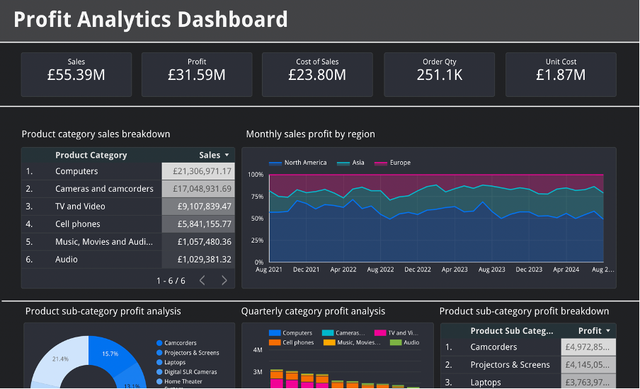

<h1 align'center'>Profit Analysis Dashboard using Looker Studio</h1>

The project is to build a dashboard exploring the given sales data and the amount of profit made with retail products by seller X. Google's looker studio is used to build the dashboard.

[Click here to view the dashboard](https://lookerstudio.google.com/reporting/c53aaa73-73c5-4893-8303-cdc03263c4d6)
 
 

  

